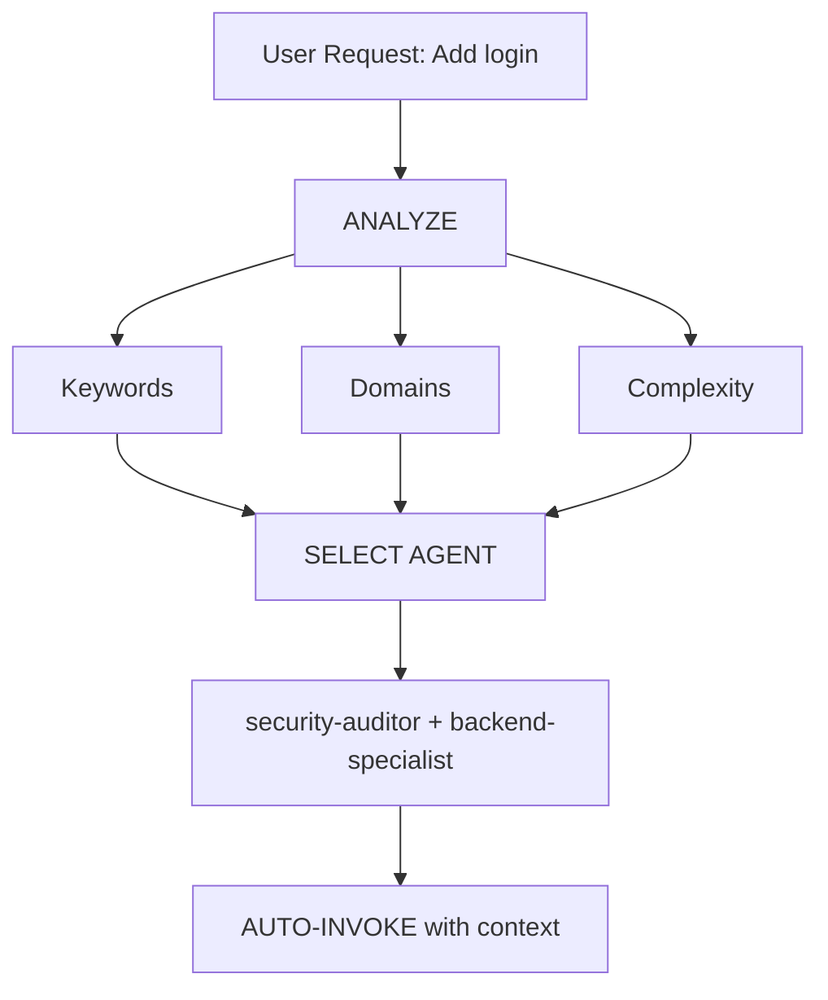

# Intelligent Agent Routing

**Purpose**: Automatically analyze user requests and route them to the most appropriate specialist agent(s) without requiring explicit user mentions.

## Core Principle

> **The AI should act as an intelligent Project Manager**, analyzing each request and automatically selecting the best specialist(s) for the job.

## How It Works

### 1. Request Analysis

Before responding to ANY user request, perform automatic analysis:

### 2. Agent Selection Matrix & Routing Protocol

The complete agent selection matrix, domain detection rules, complexity assessment criteria, implementation rules, and edge case handling are defined in ssets/routing-logic.md.

**Action:** Load ssets/routing-logic.md to access the full routing decision tree, keyword-to-agent mappings, and integration guidelines.
---

**Next Steps**: Integrate this skill into GEMINI.md TIER 0 rules.

