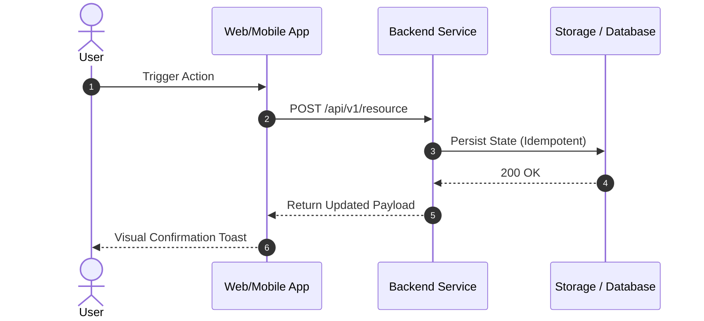

# 📄 PRD: [Feature / Initiative Name]

> **Executive Summary**: [1-2 sentences explaining what is being built, for whom, and why now.]

---

## 1. Problem Statement & Customer Context
- **Target Persona**: Who specifically experiences this friction? (e.g. *Enterprise RevOps Admin managing 500+ seats*).
- **Core Friction & Root Cause**: What is blocking the customer today? What is the quantifiable cost of this problem?
- **Evidence & Customer Quotes**:
  > *"[Verbatim customer quote from interview or support ticket illustrating the acute pain.]"* — [[3. Meetings/notes/[interview-slug]|Customer Name]]

---

## 2. Jobs To Be Done (JTBD) & User Stories

### Job Stories (JTBD)
- **Primary Job**: When `[trigger event / situation]`, I want to `[execute action]`, so I can `[achieve high-value outcome]`.
- **Secondary Job**: When `[edge condition]`, I want to `[mitigate friction]`, so I can `[maintain workflow continuity]`.

### User Stories & Acceptance Criteria
#### Story 1: [Core Workflow Capability]
- **As a** `[user role]`
- **I want** `[system capability]`
- **So that** `[business/user value]`

```gherkin
Scenario: Happy Path Execution
  Given [initial user state / system precondition]
  When [user triggers action]
  Then [expected system reaction occurs within target latency]
  And [state change is persisted]
```

---

## 3. Solution Overview & User Experience
- **Functional Requirements**:
  1. `[Requirement 1]`: [Detailed behavior and business logic].
  2. `[Requirement 2]`: [Edge case handling and validation].
- **Scope Boundaries (Non-Goals)**:
  - ❌ *Out of Scope for V1*: [Explicitly deferred capabilities].
  - ❌ *Non-Goal*: [What this feature is deliberately NOT trying to solve].



---

## 4. Hypotheses, Metrics & Guardrails

| Metric Type | Metric Name | Baseline | Target (60 Days Post-Launch) |
|:---|:---|:---:|:---:|
| **Primary (North Star)** | User Task Completion Rate | 42% | **$\ge 75\%$** |
| **Secondary (Speed)** | Time to First Value (TTFV) | 4.2 days | **$< 24$ hours** |
| **Guardrail (Quality)** | P99 API Latency / Error Rate | 120ms / 0.1% | **$< 200$ms / $< 0.1\%$** |

---

## 5. Dependencies & Technical Considerations
- **Upstream Dependencies**: [Services, APIs, or design components required].
- **Downstream Impact**: [Data pipeline, analytics, or CRM sync affected].
- **Security & Compliance**: [RBAC permissions, audit logging, PII considerations].

---

## 6. Launch Gates & Rollout Strategy
- [ ] **Alpha Gate**: 5 design-partner customers validated in staging environment.
- [ ] **Beta Gate**: 20% canary traffic rollout with zero error spikes for 7 consecutive days.
- [ ] **General Availability (GA)**: 100% rollout with updated documentation and sales enablement.
