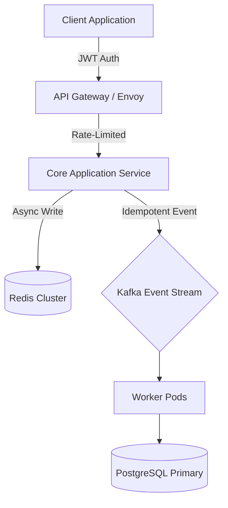

# 🏗️ Technical Specification & ADR: [System / Architecture Component]

> **Status**: `[PROPOSED | ACCEPTED | REJECTED | DEPRECATED]`  
> **PRD Reference**: [[2. Products/specs/[prd-slug]|Related PRD]]

---

## 1. Context & Architectural Problem Statement
- **Background**: [Why is this technical change required? What are the scale, latency, or reliability constraints?]
- **Goals**:
  - P99 latency $< 100\text{ms}$ under $10\text{k}$ requests/sec.
  - Zero downtime migration with automatic rollback triggers.
- **Non-Goals**: [Explicit boundaries out of scope for this RFC].

---

## 2. Architecture Decision Record (ADR)
- **Decision**: [The selected technical approach / technology stack / data model].
- **Rationale**: [Why this choice was selected over evaluated alternatives].
- **Tradeoffs**: [Acknowledged technical debt, operational burden, or complexity].



---

## 3. Data Models & Interface Contracts

### Data Schema (PostgreSQL)
```sql
CREATE TABLE workspace_subscriptions (
    id UUID PRIMARY KEY DEFAULT gen_random_uuid(),
    workspace_id UUID NOT NULL REFERENCES workspaces(id) ON DELETE CASCADE,
    tier VARCHAR(32) NOT NULL DEFAULT 'standard',
    status VARCHAR(32) NOT NULL DEFAULT 'active',
    metadata JSONB NOT NULL DEFAULT '{}'::jsonb,
    created_at TIMESTAMPTZ NOT NULL DEFAULT NOW(),
    updated_at TIMESTAMPTZ NOT NULL DEFAULT NOW()
);
CREATE INDEX idx_workspace_subscriptions_active ON workspace_subscriptions(workspace_id) WHERE status = 'active';
```

### API Interface (OpenAPI / REST)
```http
POST /api/v1/workspaces/{workspace_id}/subscriptions
Content-Type: application/json
Idempotency-Key: 8a1b2c3d-4e5f-6a7b-8c9d-0e1f2a3b4c5d

{
  "tier": "enterprise",
  "auto_renew": true
}
```

---

## 4. Failure Modes, Security & Rollback Plan
- **Failure Recovery**: If message broker fails, fallback to local transactional outbox pattern.
- **Security & PII**: All tenant identifiers encrypted at rest; RBAC checked at gateway layer.
- **Rollback Criteria**: Automated deployment rollback triggered if 5xx error rate exceeds $0.05\%$ over a 3-minute window.
