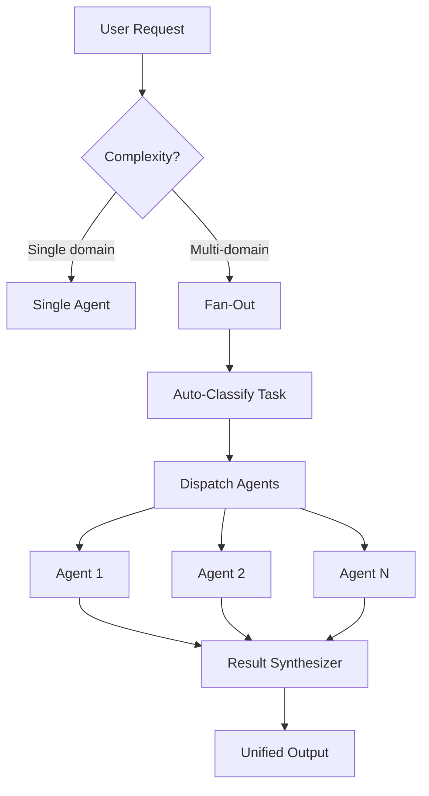

> **Compatibility Directive**: This component is optimized primarily for the Google Antigravity runtime, but gracefully degrades to support Gemini CLI, Claude Code, and Kilocode CLI.

# /fan-out — Multi-Agent Parallel Dispatch Workflow

**Trigger**: `/fan-out [task description]` or when a task requires multiple domain perspectives simultaneously.

> **Capability**: This workflow activates multiple agents in parallel, collects their outputs, resolves conflicts, and produces a unified response. It is the core of the Antigravity agentic mesh.

---

## When to Use Fan-Out

### Fan-Out Triggers

| Request Type | Agents Activated |
|:-------------|:----------------|
| PRD from scratch | `staff-pm` + `ux-researcher` + `tech-lead` |
| Launch planning | `gtm-lead` + `program-manager` + `staff-pm` |
| Strategic roadmap | `cpo` + `strategist` + `data-scientist` |
| Release coordination | `program-manager` + `tech-lead` + `staff-pm` |
| Discovery sprint | `staff-pm` + `ux-researcher` + `data-scientist` |
| Competitive analysis | `strategist` + `data-scientist` |
| Custom | Specify agents explicitly |

---

## Execution Protocol

### Step 1: Task Classification

Before dispatching, identify the task type and select the agent roster:

| Keywords | Recommended Roster |
|:---------|:------------------|
| "plan", "roadmap", "vision" | `cpo`, `strategist` |
| "prd", "spec", "requirements" | `staff-pm` |
| "launch", "gtm" | `gtm-lead`, `program-manager` |
| "data", "metrics", "funnel" | `data-scientist` |
| "user research", "interview" | `ux-researcher` |
| "release", "dependency" | `program-manager`, `staff-pm` |

### Step 2: Native Parallel Dispatch

**Rule**: All independent agents MUST be dispatched simultaneously using the runtime's native parallelism.

- **Antigravity**: Use `waitForPreviousTools: false` to invoke multiple agent tool calls in parallel
- **CLI runtimes**: Execute agents sequentially (graceful degradation)

For each selected agent:
1. Load the agent persona from `.agent/agents/{agent}.md`
2. Load the relevant skills from the agent's `skills:` frontmatter
3. Execute the agent's task with the loaded context

### Step 3: Result Synthesis

After all agents complete, synthesize their outputs:

1. **Merge** outputs from all agents into a unified response
2. **Detect conflicts** where agents produce contradictory recommendations
3. **Escalate** strategic conflicts to CPO
4. **Log** decisions in `5. Trackers/DECISION_LOG.md`

### Step 4: Route to Trackers

Apply the synthesized output using standard routing:

| Output Type | Destination |
|:-----------|:-----------|
| PRD / Spec | `2. Products/[Company]/[Product]/` |
| Task items | `5. Trackers/TASK_MASTER.md` |
| Decision | `5. Trackers/DECISION_LOG.md` |
| Risk items | `5. Trackers/DEPENDENCY_MAP.md` |
| Boss Ask | `5. Trackers/critical/boss-requests.md` |

---

## Output Format

`> **Output Formatting**: Read the template at .agent/skills/core-utility/assets/fan_out_synthesis_template.md and use it to format your output.`

---

## Notes

- **Concurrency**: Antigravity dispatches agents natively in parallel; CLIs run sequentially
- **Failure Isolation**: One agent failure does NOT block other agents
- **Privacy**: Fan-out results inherit the same privacy rules (no PII in outputs)
