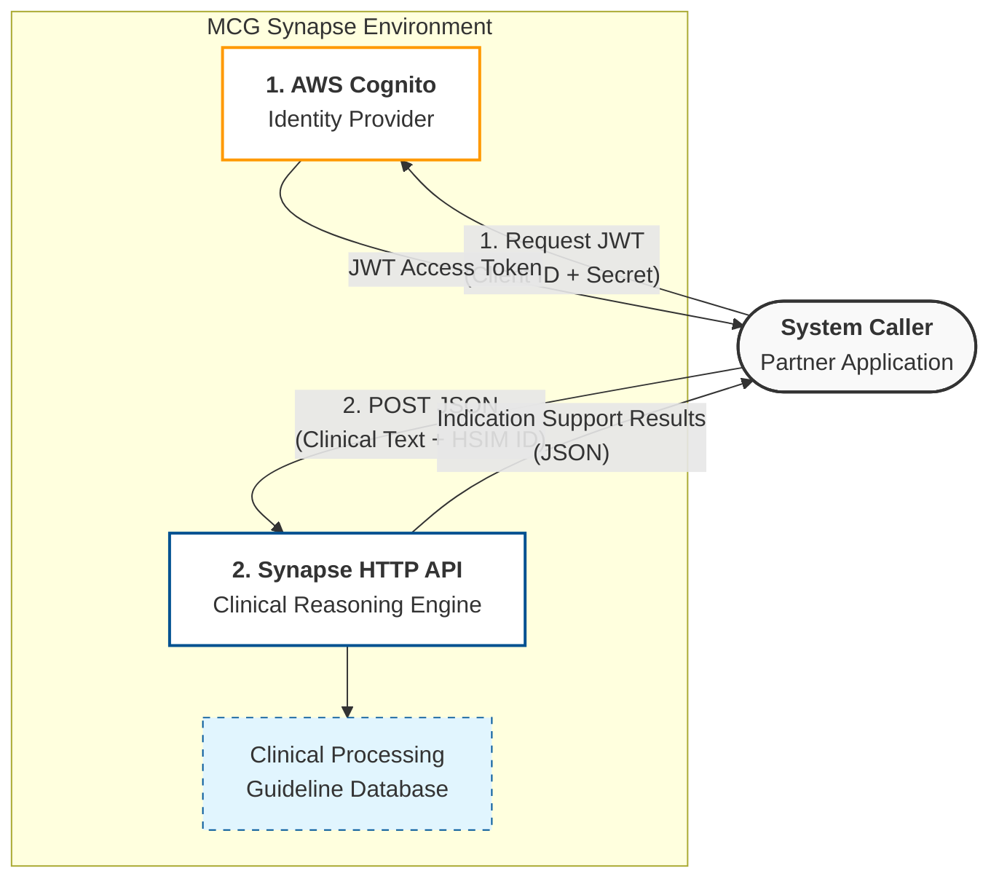

# Synapse API Architecture Visual

```mermaid
graph TD
    subgraph "MCG Synapse Environment"
        Cognito["<b>1. AWS Cognito</b><br/>Identity Provider"]
        API["<b>2. Synapse HTTP API</b><br/>Clinical Reasoning Engine"]
        Engine["Clinical Processing<br/>Guideline Database"]
        
        API --> Engine
    end

    User(["<b>System Caller</b><br/>Partner Application"])
    
    %% Step 1: Auth
    User -- "1. Request JWT<br/>(Client ID + Secret)" --> Cognito
    Cognito -- "JWT Access Token" --> User

    %% Step 2: Execution
    User -- "2. POST JSON<br/>(Clinical Text + HSIM ID)" --> API
    API -- "Indication Support Results<br/>(JSON)" --> User

    %% Styling
    style User fill:#f9f9f9,stroke:#333,stroke-width:2px
    style Cognito fill:#fff,stroke:#ff9900,stroke-width:2px
    style API fill:#fff,stroke:#005191,stroke-width:2px
    style Engine fill:#e1f5fe,stroke:#01579b,stroke-dasharray: 5 5
```
