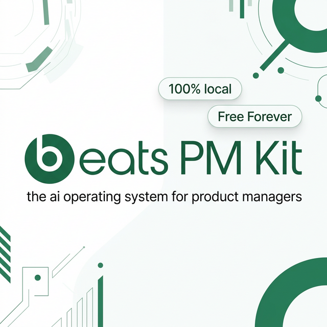

<div align="center">



<br/>

# Beats PM Kit: AI Product Management Operating System

### Local-first product operations for AI-forward product managers

<p><strong>Beats PM Kit helps product managers find what was said, decided, and committed across past meetings and conversations—then turn that evidence into current tasks, decisions, plans, and follow-ups.</strong></p>

<p>
  
  &nbsp;
  
  &nbsp;
  <a href="https://github.com/officebeats/beats-pm-kit/stargazers"></a>
  &nbsp;
  
</p>

<p>
  
   -
  
   -
  
   -
  
</p>

<br/>

<p>
  <a href="#quick-start"></a>
</p>

</div>

---

## AI Product Management Workflows

Product managers lose time because product context is scattered across Granola and Quill meetings, Slack threads, Teams chats, Outlook, product documents, screenshots, and half-finished notes. Beats PM Kit archives that evidence locally, makes the full text searchable, and triangulates it into current workstreams and tasks.

The kit is designed for product managers, product leaders, founders, and AI-native operators who want a fast way to manage PM work with AI while keeping source documents, task state, and workflow outputs organized on their own machine. It supports daily product operations like meeting notes to tasks, PM task management from local documents, stakeholder follow-up, product discovery, PRD writing, roadmap planning, launch preparation, bug triage, and executive-ready status updates.

It is not a generic prompt pack. It is a local-first product management workspace with agents, skills, slash-command workflows, task ledgers, privacy guardrails, and runtime adapters for tools such as Google Antigravity and OpenAI Codex.

## Built And Used Daily By An AI-Forward PM

I built Beats PM Kit because I needed a practical AI PM operating system for my own daily product work. I use it to process real product-management context: meeting transcripts, partner follow-ups, stakeholder asks, task triage, planning artifacts, reasoning QA, developer portal work, release questions, and the operational noise that usually gets lost between tools.
The result is both a working toolkit and a portfolio of AI-forward product management practice: context engineering, local-first AI workflows, agentic task management, privacy-aware automation, and cross-runtime PM operations. The goal is simple: make an AI assistant useful for the messy middle of product work, not only for polished strategy docs.

## Core Functionality

| Capability | What the kit supports |
|:---|:---|
| AI PM operating system | A structured workspace for product strategy, product execution, stakeholder context, meeting notes, task ledgers, PRDs, roadmaps, and reusable product workflows. |
| Local-first PM task management | Human-readable task notes, evidence links, generated task/workstream indexes, daily triage, and durable local reports. |
| Meeting notes to tasks | Transcript and chat-intake workflows that extract action items, blockers, owners, dates, decisions, and follow-up questions into local artifacts. |
| Context-aware task routing | PM Decision Router, task-manager workflows, and bounded communication intake for Slack, Teams, Outlook, Calendar, Jira, and Confluence context. |
| Cross-runtime product management workflow | Runtime adapters generated from one schema-v2 command registry so each active runtime loads the same workflow and execution profile. |
| Future-proof model adaptation | Runtime defaults are inherited, explicit model promotions stay local and evaluation-gated, and unknown capabilities fail closed without silent provider switching. |
| Product documentation and PRDs | `/create`, `/plan`, `/sop`, `/deck`, `/review`, and related skills for PRDs, one-pagers, runbooks, launch materials, and decision docs. |
| Local document reference | Folder conventions, manifests, transcript archives, context artifacts, resource docs, and markdown links help agents cite local files instead of relying on memory. |
| Optional semantic memory recall | `/memory` can use an explicitly enabled local IAI companion for bounded recall, then verify important claims against dated Markdown evidence. |
| Markdown and optional Obsidian graph | The kit works as plain Markdown first. Obsidian can be used as an optional direct vault for graph navigation without duplicating files. |
| Privacy-aware automation | Private workspace folders are gitignored, generated runtime folders stay local, and privacy checks guard against publishing personal files, secrets, transcripts, or adapter bloat. |

## Current Release Surface

Release `v11.2.0` exposes 22 canonical agents, 74 focused skills, 44 workflows, 23 promoted Codex skills, 5 supported runtimes, and 3 execution profiles. These counts come from the canonical `.agent/` source rather than a hand-maintained marketing list.

Run `python system/scripts/feature_inventory.py --json` for the current machine-readable inventory. See [Codex Commands](CODEX_COMMANDS.md) for generated command-to-workflow routing and the [workflow catalog](system/docs-site/workflows/index.md) for the human-readable reference.

## Local-First PM Task Management

Beats PM Kit treats the local workspace as the source of truth. Tasks live in `5. Trackers/`, communication evidence is archived in `3. Meetings/`, stakeholder context lives in `4. People/`, and reusable product context can live in `6. Resources/`, `7. Partners/`, and `8. Clients/`.

The default task-management flow is Markdown-first:

1. Archive evidence from Granola, Quill, Outlook, Teams, Slack, or local transcripts.
2. Triangulate that evidence against existing tasks and workstreams.
3. Update one human-readable Markdown task note as the source of truth.
4. Regenerate Task Master and workstream navigation from those task notes.
5. Surface stale, overdue, blocked, unclear, duplicated, or possibly complete work as explicit questions.
6. Optionally open the same Markdown files in Obsidian or send accepted state to an enabled pack.

`5. Trackers/tasks/` is canonical. Each task has a descriptive filename, readable title/H1, stable internal ID in frontmatter, evidence, progress, and decisions. `TASK_MASTER.md` and `WORKSTREAMS.md` are generated navigation; Obsidian and optional board packs do not replace or duplicate task state.

This makes the kit useful for fast PM triage without letting automation silently rewrite your priorities.

## Runtime-Neutral Support

The kit uses whichever supported runtime is actively running and chooses behavior by positively detected capabilities, not a permanent provider hierarchy. Routing lives only in `.agent/command-registry.json`; adapters, manifests, architecture counts, and compatibility documentation are generated from it.

| Runtime | Adapter | How it works |
|:---|:---|:---|
| Google Antigravity | `.agent/rules/GEMINI.md` | Uses canonical workflows and reported native capabilities. |
| OpenAI Codex | `AGENTS.md` | Uses a thin startup adapter and the generated command/profile index. |
| Gemini CLI | `GEMINI.md` | Uses generated local adapters from the same registry. |
| Claude Code | `CLAUDE.md` | Uses generated project skills and command pointers. |
| KiloCode | `.kilocode/rules.md` | Uses generated local rules, skills, agents, and workflows. |

See the generated [runtime and model compatibility table](system/docs/runtime-compatibility.md). Runtime-specific root files stay thin so a model receives only the active workflow, relevant evidence, and required skill guidance.

## Context Engineering For Product Managers

The kit is built around context engineering: retrieve the right source material at the right time instead of stuffing every meeting, PRD, and chat transcript into every prompt.

The practical patterns are:

- `AGENTS.md` and runtime adapters act as routers.
- `.agent/workflows/` define repeatable PM playbooks.
- `.agent/skills/` provide focused capabilities such as task management, meeting synthesis, PRD authoring, risk review, documentation, product strategy, Socratic deep interviews with ambiguity gating (`/interview`), bug lifecycle tracking, epic hypothesis framing, market positioning, and job-story requirements translation.
- Local manifests track bounded communication intake windows.
- Task triage scripts identify stale or risky work without guessing closure.
- Optional Obsidian setup turns the existing kit folder into a direct Markdown vault without creating a mirrored copy.

This keeps the kit snappy while preserving reliable references to local files and documents.

## Quick Start

### 1. Agent-First Bootstrap

Give Codex, Antigravity, or a supported CLI agent the repo URL:

```text
https://github.com/officebeats/beats-pm-kit
```

The agent should clone or open the repo, then run the canonical bootstrap:

```bash
python3 system/scripts/bootstrap.py --agent --non-interactive --repo-url https://github.com/officebeats/beats-pm-kit
```

Bootstrap creates the ignored local workspace, seeds templates, syncs runtime adapters, installs hooks when possible, runs privacy and adapter health checks, and prints the exact kit folder to open when it offers optional Obsidian setup.

### Existing-kit upgrade safety

Before bootstrap or update changes an existing workspace, Beats PM Kit runs a compatibility gate:

```bash
python3 system/scripts/upgrade_compat.py --json
```

The check inventories legacy Markdown titles, task IDs, Task Master links, workstream notes, Granola/Quill/Outlook/Teams/Slack evidence setup, legacy local model pins, and any ignored personal-memory companion config. It does not rename files or write anything.

If the report contains only safe title additions, apply them through the reversible migration:

```bash
python3 system/scripts/upgrade_compat.py --apply
```

Every changed file is backed up under `.beats/backups/`, written atomically, and left at its existing path so older links keep working. Legacy model choices move into ignored `.beats/model-policy.json`; newer evaluated choices win, preview or unavailable-looking pins generate warnings, and conflicting pins block the upgrade. Valid personal-memory choices are preserved without touching the external store; malformed or unknown config schemas block the upgrade. Ambiguous titles, duplicate task IDs, and broken task links also block the upgrade. New notes use descriptive filenames; legacy filenames are renamed only through a later explicit backlink-aware operation.

This same URL-only flow is supported for Codex, Gemini CLI, Claude Code, and KiloCode. Start the CLI in a safe parent folder, paste the repo URL as the first request, and let the agent run the bootstrap command from the cloned repo root.

Terminal fallback:

```bash
git clone https://github.com/officebeats/beats-pm-kit
cd beats-pm-kit
./install.sh
```

Python 3.11+ is recommended and tested in CI. Optional runtime integrations may use their own CLIs, desktop apps, or additional version requirements.

### 2. Launch Your AI Runtime

Open the `beats-pm-kit` folder in your preferred AI coding or agent runtime.

| Runtime | Launch command or action | Best use |
|:---|:---|:---|
| [Google Antigravity](https://antigravity.google/) | Open this folder in Antigravity | Fastest power-user workflow and parallel agent fan-out. |
| [OpenAI Codex](https://github.com/openai/codex) | `codex` | Local Codex workflow using `AGENTS.md`, shell commands, and repo files. |
| [Gemini CLI](https://github.com/google-gemini/gemini-cli) | `gemini` | File access, web search, and tool use with generated adapters. |
| [Claude Code](https://docs.anthropic.com/en/docs/agents-and-tools/claude-code/overview) | `claude` | Agentic file work and command dispatch through generated adapters. |
| [KiloCode](https://kilocode.ai/) | `kilo` | Additional local agent compatibility. |

Start the runtime you already use from the repo root. The active-runtime probe will retain its inherited model defaults and route `/day`, `/track`, `/paste`, `/transcript`, `/plan`, or `/create` through the same canonical profile-aware workflows.

### 3. Run First-Time Setup

```text
/start
```

The setup workflow calls the same bootstrap backend, then asks for optional profile details such as your name, manager, product focus, and local operating preferences.

Type `/help` anytime to see the workflow catalog.

## Common Product Management Workflows

| Workflow | Use it when you need to |
|:---|:---|
| `/find` | Search past meeting, transcript, chat, decision, task, and product evidence in parallel; optional semantic leads are verified against local Markdown. |
| `/memory` | Recall candidate context, verify it against dated local evidence, and consolidate durable facts and decisions. |
| `/paste` | Turn copied text, screenshots, files, or visible work signals into local task-management evidence. |
| `/track` | Manage tasks, bugs, boss asks, follow-ups, and local task detail files. |
| `/obsidian` | Set up the existing kit folder as an optional vault, show exact task paths, or open Task Master. |
| `/pack` | List, enable, disable, or run optional capabilities stored dormant in this repository. |
| `/day` | Generate a daily PM briefing with triage questions and top priorities. |
| `/week` | Produce a weekly tactical plan and focus areas. |
| `/meet` | Convert meeting notes or transcripts into structured notes and action items. |
| `/transcript` | Process recent transcripts into durable local meeting artifacts. |
| `/beats-comms` | Run bounded read-only intake across Slack, Teams, Outlook, and Calendar when scoped by the user. |
| `/boss` | Prepare for manager 1:1s and leadership follow-ups. |
| `/create` | Draft PRDs, specs, one-pagers, product docs, and structured PM artifacts. |
| `/plan` | Build product plans, roadmaps, OKRs, and strategic workstreams. |
| `/sop` | Create privacy-safe runbooks and standard operating procedures. |
| `/deck` | Prepare deck briefs and presentation-ready content. |
| `/review` | Review plans, docs, code, specs, and product artifacts for risk and quality. |
| `/vacuum` | Clean, archive, and optimize the local kit workspace. |

Natural language still works. Slash commands exist when you want deterministic routing.

### Complete Workflow Surface

All 44 workflows remain available even when a runtime promotes only the most common commands as native skills:

- **Evidence, communication, and tasks:** `/find`, `/memory`, `/paste`, `/track`, `/transcript`, `/meet`, `/beats-comms`, `/beats-slack`, `/beats-teams`, `/chat`, `/context`
- **Daily planning and delivery:** `/day`, `/week`, `/boss`, `/prep`, `/deck`, `/create`, `/plan`, `/sop`, `/sprint`, `/retro`, `/handoff`
- **Discovery and quality:** `/discover`, `/interview`, `/intel`, `/prioritize`, `/challenge`, `/improve-plan`, `/review`, `/accuracy`, `/regression`, `/build`
- **Setup, maintenance, and orchestration:** `/start`, `/help`, `/obsidian`, `/pack`, `/office-cli`, `/maintain`, `/update`, `/vacuum`, `/archive`, `/vibe`, `/team`, `/fan-out`

The generated [Codex command table](CODEX_COMMANDS.md) is the concise source for each workflow's execution profile, canonical file, and promotion status. Runtime adapters are generated from `.agent/command-registry.json`, so this command set cannot silently diverge by provider.

### Optional packs without extra repositories

Optional integrations stay under `packs/` in this repository and are dormant by default. `/pack enable <name>` records the choice only in ignored `.beats/packs.json`; it does not copy files, download another repository, or add the pack to normal task routing. Trello is shipped this way and remains downstream from accepted Markdown task state.

## Architecture At A Glance

```text
User input or local file
        |
        v
Context Guard and PM Decision Router
        |
        v
Workflow loader in .agent/workflows/
        |
        v
Focused skill loading from .agent/skills/
        |
        v
Local output: tasks, notes, docs, reports, decisions
```

The repo uses a single source of truth:

```text
beats-pm-kit/
+-- 0. Incoming/           # Drop zone for raw notes, screenshots, and uploads
+-- 1. Company/            # Company context and ways of working
+-- 2. Products/           # PRDs, specs, epics, and product briefs
+-- 3. Meetings/           # Transcripts, summaries, reports, and chat archives
+-- 4. People/             # Stakeholder and relationship context
+-- 5. Trackers/           # Task ledgers, bugs, boss requests, and plans
+-- 6. Resources/          # Reference docs, planning material, optional Obsidian index
+-- 7. Partners/           # Partner context and integration materials
+-- 8. Clients/            # Client context and account materials
+-- .agent/                # Canonical agents, rules, skills, templates, workflows
+-- system/                # Scripts, tests, adapters, privacy checks
+-- .beats/                # Ignored local diagnostics, caches, reports, and test logs
+-- AGENTS.md              # Thin Codex adapter
+-- CODEX_COMMANDS.md      # Generated Codex command routing table
+-- CLAUDE.md              # Thin Claude Code adapter
+-- GEMINI.md              # Thin Antigravity/Gemini adapter
+-- README.md              # Public landing page and setup guide
```

Generated adapter directories such as `.codex/`, `.gemini/`, `.claude/`, `.kilocode/`, `.context/`, and `.obsidian/` are intentionally local and ignored.

Regenerate runtime adapters with:

```bash
python3 system/scripts/bootstrap.py --agent --non-interactive
```

Verify the public feature inventory with:

```bash
python system/scripts/feature_inventory.py --json
```

### Deterministic Local Utilities

The agent workflows delegate repeatable work to small local utilities:

| Utility | Responsibility |
|:---|:---|
| `context_router.py` | Indexed full-text retrieval across the local PM evidence folders. |
| `personal_memory.py` | Optional, bounded IAI semantic recall and separately opted-in curated capture. |
| `task_intake_fast.py` | Fast intake of one work signal without scanning the whole workspace. |
| `task_store.py` | Canonical Markdown task-note writes and generated Task Master/workstream rebuilds. |
| `critical_commitment_refresh.py` | Bounded source-health checks and commitment triage. |
| `transcript_pipeline.py` | Prepare, validate, and process recent meeting transcripts. |
| `chat_intake_state.py` | Persist bounded Slack, Teams, Outlook, and Calendar intake windows locally. |
| `obsidian_bridge.py` | Configure or open the existing kit folder as a direct Obsidian vault. |
| `pack_manager.py` | Enable dormant in-repo capabilities without creating another repository. |
| `model_policy.py` and `model_eval.py` | Resolve inherited execution profiles and evaluate explicit local model promotions. |
| `upgrade_compat.py` | Preflight and reversibly migrate legacy kit configurations. |
| `privacy_guard.py` and `adapter_guard.py` | Block private workspace leakage and generated-adapter drift before release. |

Preview local root cleanup with:

```bash
python3 system/scripts/root_cleaner.py --dry-run
```

Apply cleanup with:

```bash
python3 system/scripts/root_cleaner.py --apply
```

The cleaner moves unknown local root files into ignored `0. Incoming/root-cleanup/` instead of deleting user work.

## Optional Obsidian And Markdown Knowledge Graph

Obsidian is optional. Beats PM Kit works as a plain Markdown repo first.

Start from the same slash command in Antigravity, Codex, or Claude Code:

```text
/obsidian
```

The command reports the exact local paths for the kit folder, `5. Trackers/`, `TASK_MASTER.md`, and the detailed guide. Its common actions are:

```text
/obsidian setup   Configure this existing repo folder as the vault
/obsidian tasks   Open the generated Task Master over canonical task notes
/obsidian status  Inspect the app, vault, and optional MCP health
```

Open the existing `beats-pm-kit` folder directly as the vault. Do not create a mirrored copy unless you explicitly want external-vault sync. Terminal equivalents remain available for automation:

```bash
python3 system/scripts/obsidian_bridge.py guide
python3 system/scripts/obsidian_bridge.py configure --mode kit-vault
python3 system/scripts/obsidian_bridge.py open tracker
```

Setup creates local-only Obsidian settings and a graph index under `6. Resources/obsidian/`. This gives product managers a local knowledge graph over tasks, meetings, people, partners, clients, SOPs, and reference documents while preserving the same files every supported agent reads.

See the [full Obsidian task-workspace guide](system/docs/obsidian.md) for path meanings, graph tips, MCP boundaries, and explicit external-vault sync.

Optional MCP read/search/open checks:

```bash
python3 system/scripts/obsidian_mcp_health.py --pretty
```

If Obsidian MCP is unavailable, agents use repo-local `rg` search. Obsidian MCP is read/search/open-only; task writes continue through the canonical local Markdown workflow.

## Optional Personal Memory Companion

Beats PM Kit can use [IAI Personal Memory Engine](https://github.com/CodeAbra/iai-personal-memory-engine) as a local semantic-recall accelerator. The integration is disabled by default, dependency-free inside this repo, and fail-open: when IAI is missing, slow, or unhealthy, `/memory` and `/find` continue with canonical local Markdown and `rg`.

Beats PM Kit never installs IAI, starts its daemon, enables ambient hooks, uploads files, or changes its external store. Recall results are treated as untrusted leads and checked against dated meeting, decision, task, or product files before consequential action. Capture has a separate explicit opt-in and is limited to short curated memories.

```bash
python3 system/scripts/personal_memory.py status --json
python3 system/scripts/personal_memory.py configure --enable --json
python3 system/scripts/personal_memory.py recall "What did we decide about launch timing?" --limit 5 --json
```

See the [Personal Memory Companion guide](system/docs/personal-memory.md) for privacy boundaries, dedicated-store setup, curated capture, reset, and upgrade behavior.

## Privacy-Aware Local Workspace

The kit stores private product-management context locally by default.

| Data type | Default local location | Published by the kit |
|:---|:---|:---:|
| Company strategy and ways of working | `1. Company/` | No |
| Product docs and PRDs | `2. Products/` | No |
| Meeting transcripts and chat archives | `3. Meetings/` | No |
| Stakeholder context | `4. People/` | No |
| Task trackers and task detail files | `5. Trackers/` | No |
| SOPs and operational runbooks | `6. SOPs/` | No |

Folders 1-5 are `.gitignored` by default, and private folders are tracked only through skeleton `.gitkeep` files. The repo also includes checks such as `system/scripts/privacy_guard.py --tree` and `system/scripts/adapter_guard.py --mode check` to prevent private content, local runtime state, personal paths, token-like strings, transcripts, and generated adapter folders from entering shared kit commits.

Important caveat: this repo does not sync your private PM files to a kit cloud service, but your chosen AI runtime/model provider may process prompts, attachments, or tool outputs according to that provider's product and account settings.

## Runtime Compatibility

The generated [runtime and model compatibility table](system/docs/runtime-compatibility.md) is derived from the command registry and cannot drift independently.

Check the current machine and resolve a workflow without changing providers:

```bash
python3 system/scripts/model_policy.py status --json
python3 system/scripts/model_policy.py resolve track --signal conflicting_evidence --json
```

## Model Adaptation And Evaluation

Fast, Balanced, and Deep are workflow profiles, not provider-specific model names. Normal resolution uses `model: inherit`, so runtime improvements benefit the kit without a release. Conflicting evidence, high-stakes decisions, external mutations, broad changes, and validation failures escalate to Deep. If Deep support is not reported, the kit keeps the active runtime's inherited model and emits a visible warning.

Offline CI uses eight sanitized deterministic scenarios. Live comparisons are local-only, require `--allow-live`, run exactly three times per scenario, and store raw outputs only under ignored `.beats/evals/`. A candidate is promotable only after all safety gates pass and it meets the quality or latency threshold without a silent provider change.

```bash
python3 system/scripts/model_eval.py run --mode offline --json
```

Use `/maintain` for model status, live comparison, promotion, backup, and reset guidance. Skills and providers are never rewritten automatically.

## Power User Tools

These tools are optional. The kit does not require them, but advanced users may find them useful.

| Tool | Description |
|:---|:---|
| [OpenCLI](https://github.com/jackwener/opencli) | Universal CLI hub for turning apps, local binaries, and websites into scriptable agent commands. |
| [Horizon](https://github.com/peters/horizon) | Spatial terminal workspace for managing terminals, agents, and development tools. |

## Antigravity Enhancements

Community extensions can improve Antigravity workflows. Install from the Extensions panel or the [Open VSX Registry](https://open-vsx.org/).

| Extension | Description | Install |
|:---|:---|:---:|
| [Antigravity Cockpit](https://open-vsx.org/vscode/item?itemName=jlcodes.antigravity-cockpit) | Dashboard-style quota monitor for Antigravity AI usage, limits, and spending. | `jlcodes.antigravity-cockpit` |
| [Antigravity iOS App](https://open-vsx.org/vscode/item?itemName=uladluch.antigravity-mobile-connector) | Control Antigravity from an iPhone, send prompts, monitor generations, and manage projects. | `uladluch.antigravity-mobile-connector` |
| [AG Auto Click & Scroll](https://open-vsx.org/vscode/item?itemName=zixfel.ag-auto-click-scroll) | Auto-click Run and Allow buttons, plus auto-scroll the chat panel. | `zixfel.ag-auto-click-scroll` |
| [Pencil](https://open-vsx.org/vscode/item?itemName=highagency.pencildev) | Create, edit, and preview `.pen` design files with AI assistance. | `highagency.pencildev` |
| [Antigravity Flush](https://open-vsx.org/vscode/item?itemName=pkkkkkkkkkkkkk.antigravity-flush) | Clear context when model sessions hit token-limit issues. | `pkkkkkkkkkkkkk.antigravity-flush` |
| [Antigravity Remote Control](https://open-vsx.org/vscode/item?itemName=hasugoii.antigravity-remote-control) | Control Antigravity from a phone with tunnel, QR, and real-time chat flows. | `hasugoii.antigravity-remote-control` |
| [Gemini Image Editor](https://open-vsx.org/vscode/item?itemName=Zazmic.palm-api-image-editor) | In-editor image tools for WebP conversion, resizing, and background removal. | `Zazmic.palm-api-image-editor` |
| [Antigravity Sync](https://open-vsx.org/vscode/item?itemName=samador.antigravity-settings-sync) | Sync Antigravity settings and extensions across machines using GitHub. | `samador.antigravity-settings-sync` |
| [Better Antigravity](https://open-vsx.org/vscode/item?itemName=kanezal.better-antigravity) | Community-driven fixes such as auto-run improvements and chat rename support. | `kanezal.better-antigravity` |
| [Antigravity Autopilot](https://github.com/timteh/antigravity-autopilot) | Auto-accept agent steps using OS-level accessibility on Windows. | `timteh.antigravity-autopilot` |

## System Rules

The kit operates from `.agent/` as the canonical system. Runtime-specific root files stay thin and generated where possible.

| File | Purpose |
|:---|:---|
| `.agent/rules/GEMINI.md` | System constitution, Context Guard, agent and skill loading protocol, privacy directives, and architecture overview. |
| `AGENTS.md` | Codex startup and slash-command adapter. |
| `.agent/command-registry.json` | Only routing, profile, escalation, and runtime-policy source of truth. |
| `CODEX_COMMANDS.md` | Codex command index generated from the command registry. |
| `CLAUDE.md` | Claude Code adapter. |
| `GEMINI.md` | Antigravity and Gemini adapter. |

The Context Guard is the operating discipline behind most workflows:

1. Batch independent reads and checks.
2. Avoid unnecessary re-reads.
3. Load only the workflow and skills needed for the task.
4. Prefer local source files over memory when exact context matters.
5. Keep durable outputs in standard kit folders so runtime switching stays lossless.

## Who This Is For

Beats PM Kit is for:

- Product managers who want an AI product management toolkit that handles real operating context.
- AI-forward PMs and product leaders building repeatable agentic product workflows.
- Founders and builders who need lightweight product operations without buying another SaaS stack.
- Teams experimenting with Codex product management workflows, Antigravity product management workflows, local-first task management, and Markdown-based knowledge systems.
- Operators who want meeting notes to tasks, product docs to action plans, and local files to become useful PM context.

## Built By Product People, For Product People

Beats PM Kit is an OfficeBeats project built from daily product work, not hypothetical prompt examples.

It is a working portfolio of AI-native product operations, context engineering, local-first task management, agentic workflow architecture, and privacy-aware PM automation.

Star this repo if it helps you turn messy PM context into clearer product work.
